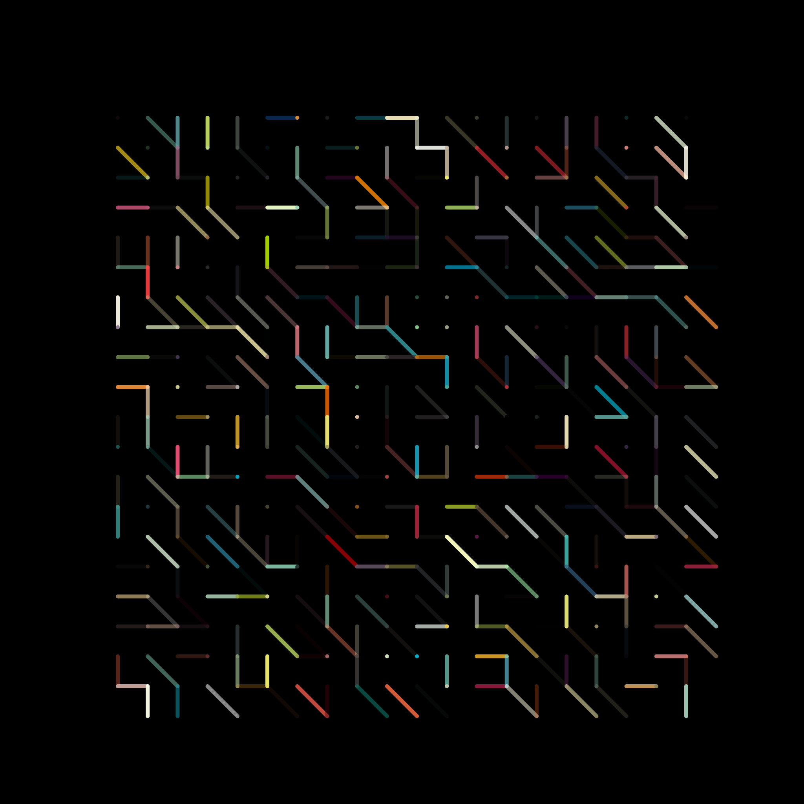
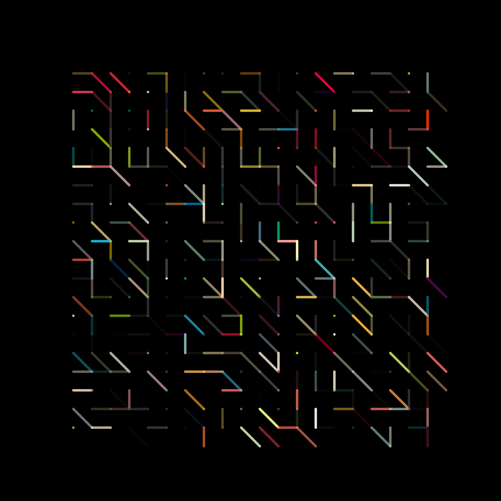
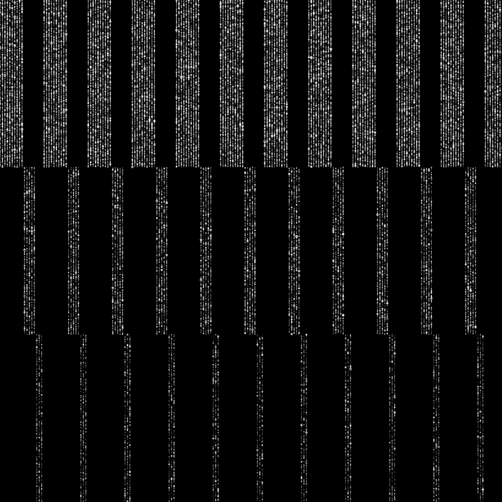
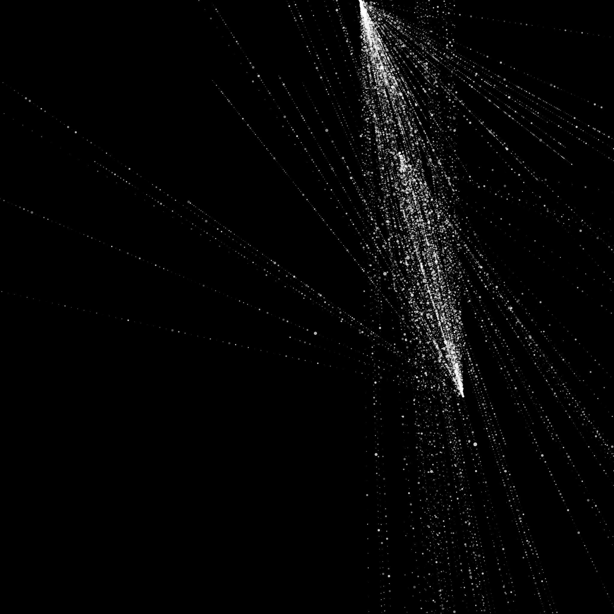
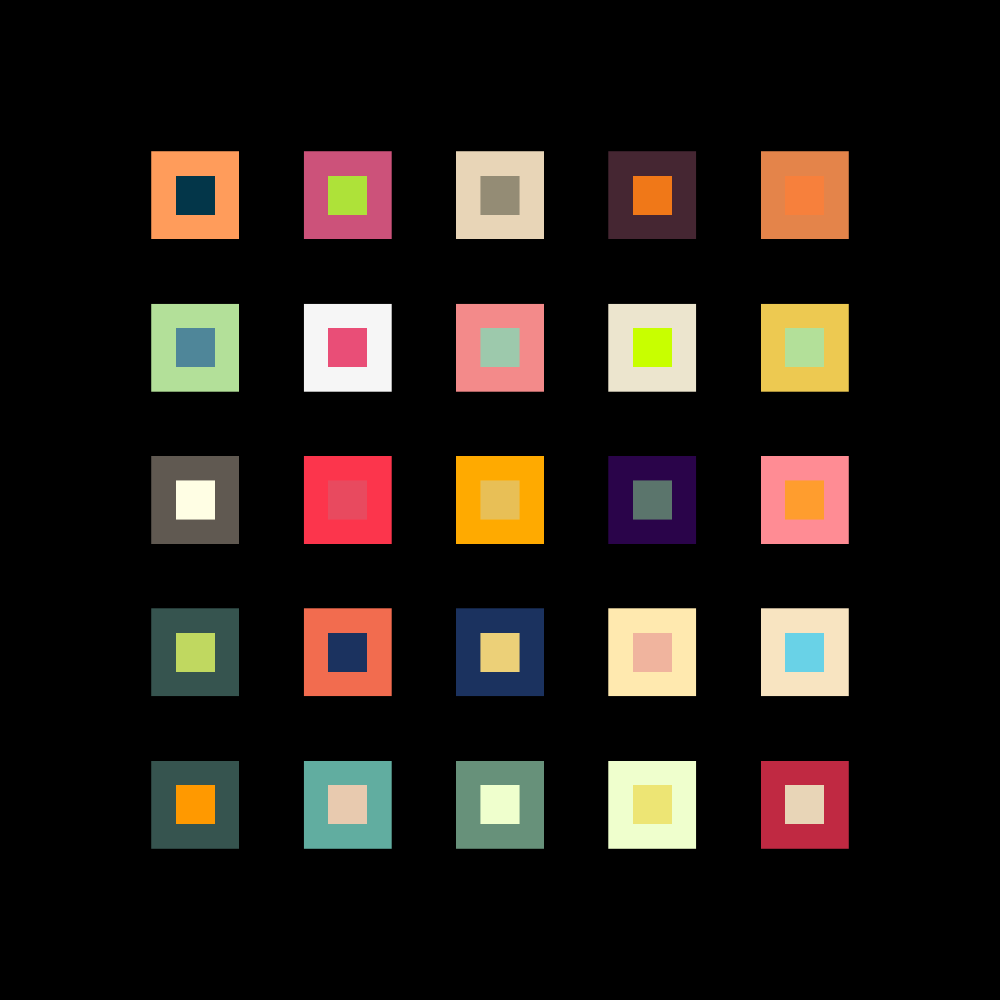
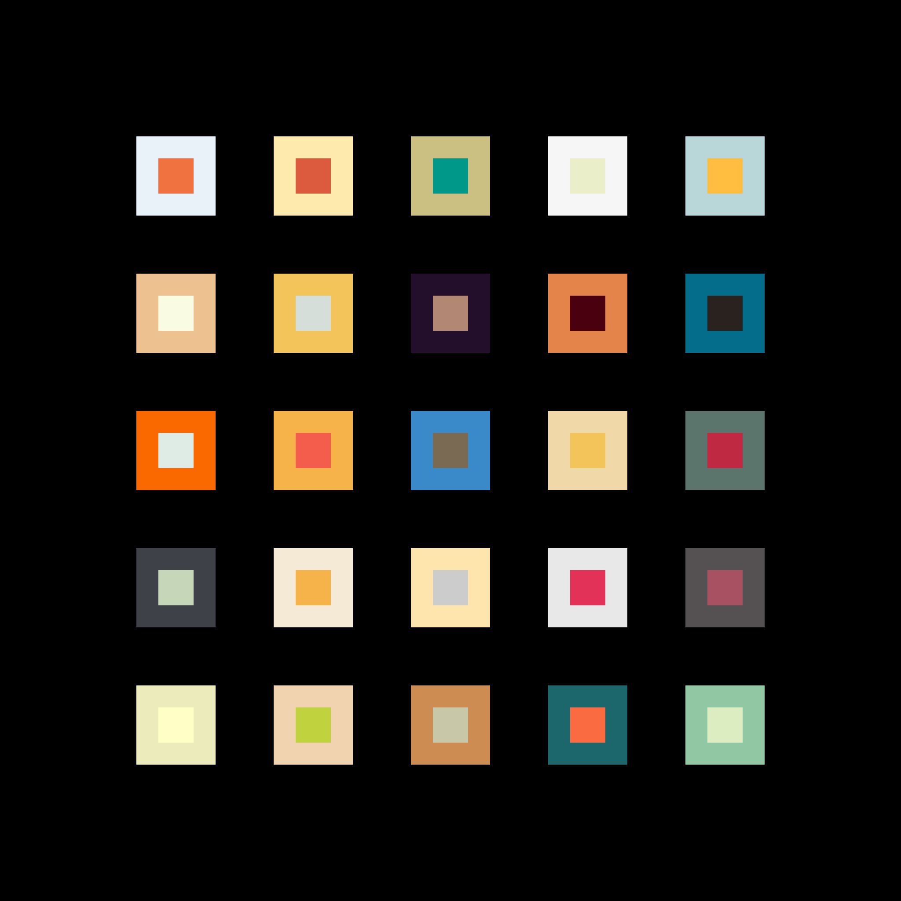
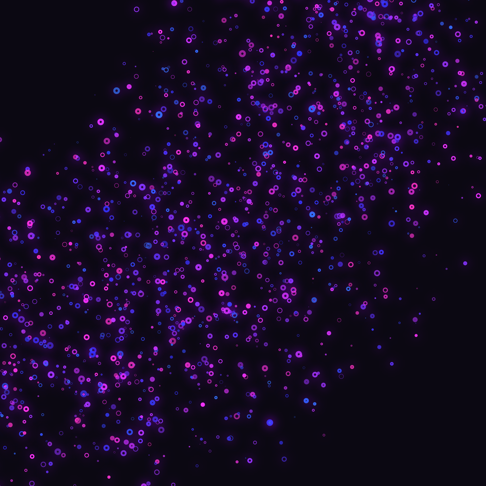
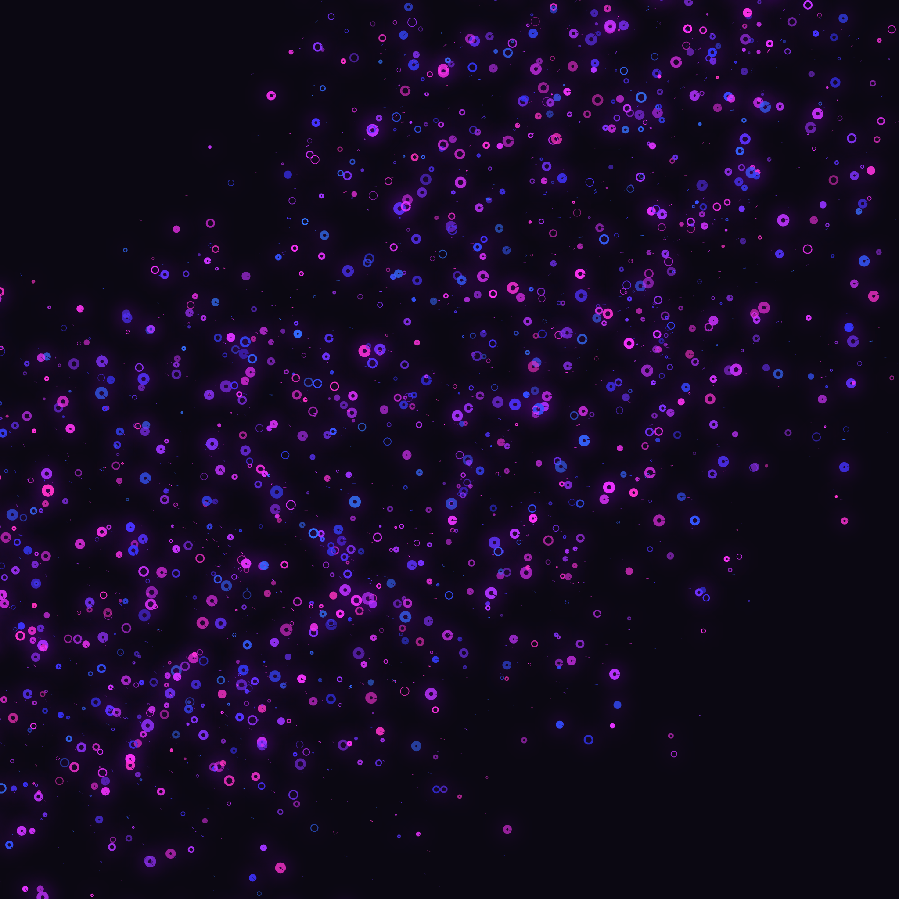
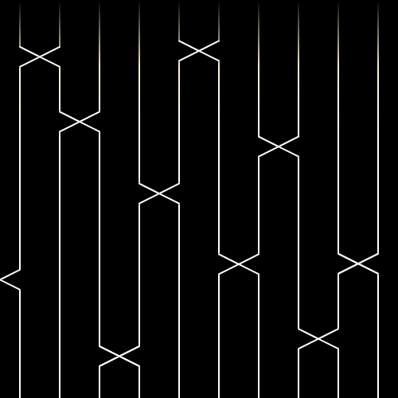
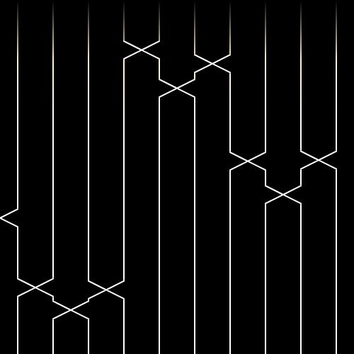

# 👾 GENERATIVE ART

To run a sketch locally

```
canvas-sketch sketch-001.js --open
```

### Requirements

Install these libraries first:

- [canvas-sketch](https://github.com/mattdesl/canvas-sketch)
- [canvas-sketch-util](https://github.com/mattdesl/canvas-sketch-util)

| File Name                        | Preview Image                                                                                  |
| -------------------------------- | ---------------------------------------------------------------------------------------------- |
| [sketch-001.js](./sketch-001.js) |  |
| [sketch-002.js](./sketch-002.js) |  |
| [sketch-003.js](./sketch-003.js) |  |
| [sketch-004.js](./sketch-004.js) |  |
| [sketch-005.js](./sketch-005.js) |  |
| [sketch-006.js](./sketch-006.js) |  |
| [sketch-007.js](./sketch-007.js) |  |
| [sketch-008.js](./sketch-008.js) |  |
